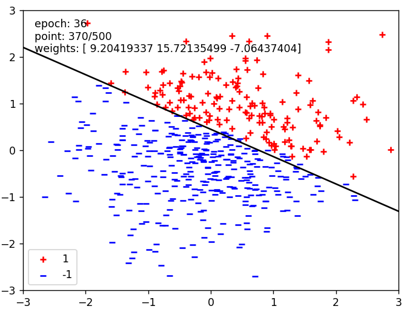
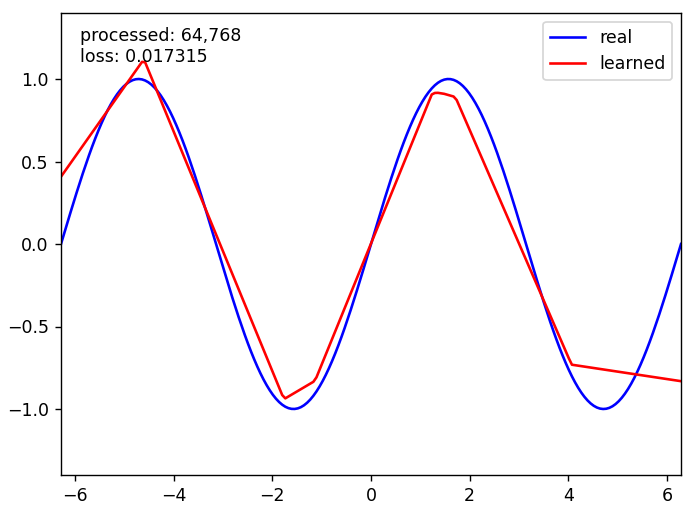

# Neural-Network-for-Digit-Classification
First project of CentraleSupélec's Artificial Intelligence course

https://centralesupelec.edunao.com/pluginfile.php/423959/course/section/60097/p1-machinelearning.html?time=1712638196490

 ## Contents
- [Question 1](#Question 1)
- [Question 2](#Question 2)
- [Question 3](#Question 3)
- [Question 4](#Question 4)

## Question 1

## Question 2

## Question 3

## Question 4

