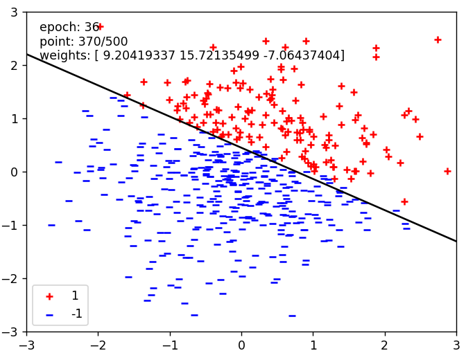
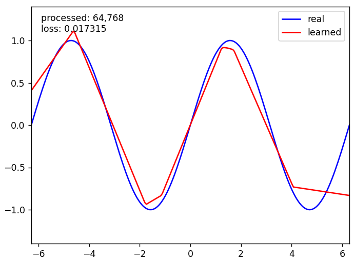
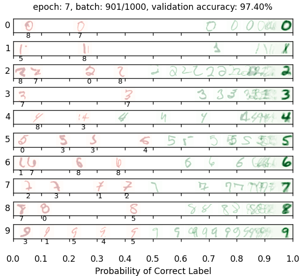
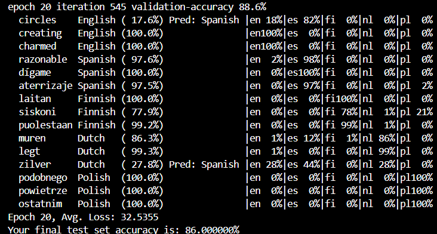

# Neural-Network-for-Digit-Classification
First project of CentraleSupélec's Artificial Intelligence course

https://centralesupelec.edunao.com/pluginfile.php/423959/course/section/60097/p1-machinelearning.html?time=1712638196490

 ## Contents
- [Question 1](#Question 1)
- [Question 2](#Question 2)
- [Question 3](#Question 3)
- [Question 4](#Question 4)

## Question 1

Implementing a binary perceptron:

## Question 2

train a neural network to approximate sin(x) over  [−2π,2π]:

## Question 3

Result of training a network to classify handwritten digits:

## Question 4

Now we're developing a compact neural network model to identify the language of individual words. Our dataset comprises words from five languages, as shown in the table below:

| Word       | Language |
|------------|----------|
| discussed  | English  |
| eternidad  | Spanish  |
| itseänne   | Finnish  |
| paleis     | Dutch    |
| mieszkać   | Polish   |

Solution:

